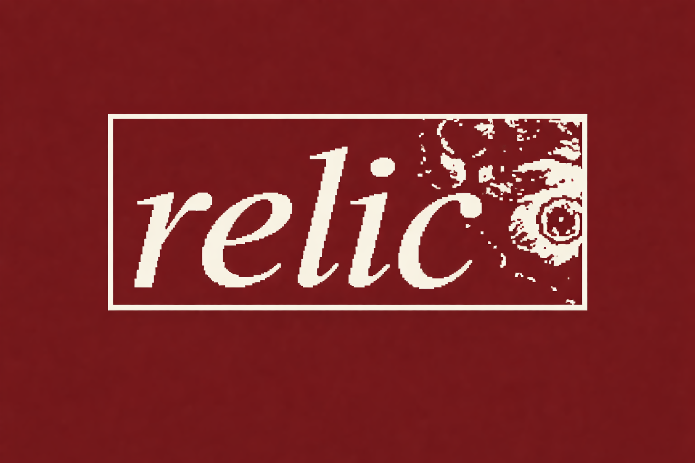

# relic
### Bring Out Your Dead

**relic** is a minimal static site generator written in Go, inspired by the legendary [werc](http://werc.cat-v.org/) by Uriel and the cat-v team from Plan 9.



## Acknowledgment

This project owes its existence to **werc**, the pioneering web system from Plan 9. werc demonstrated that web frameworks can be elegant, minimal, and fast while treating the filesystem as the source of truth.

We deeply appreciate the philosophy and design principles that werc established:
- The filesystem is the database
- Simple, composable tools
- No unnecessary complexity
- Works with standard Unix tools

The style comes from an amazing project. The last punk distro:
https://derivelinux.org/

## Why relic?

While werc is fantastic, it has specific requirements that don't fit every use case:

**werc requires:**
- A dynamic web server
- Plan 9 utilities (rc-shell)
- A running process to serve content
- CGI support

**relic offers:**
- **Static generation** - build your site once, deploy anywhere
- **Zero runtime dependencies** - just HTML, CSS, and JavaScript
- **Fast builds** - generate entire sites in milliseconds
- **Simple deployment** - host on any static file server (nginx, Apache, GitHub Pages, etc.)
- **No Plan 9 required** - works on any system with Go installed
- **Collapsible navigation** - expandable tree view of your content

## Philosophy

- **werc** treats the site as a dynamic system
- **relic** treats the site as a build output

Both approaches are valid. Choose werc for dynamic, interactive sites. Choose relic for fast, simple, static sites that can be served from anywhere.

## Quick Start

```bash
# Clone the repository
git clone https://github.com/amadv/relic
cd relic

# Build the binary
make build

# Generate the example site
make run

# View the output
ls public/
```

## Installation

```bash
# Install to ~/.local/bin (default, no sudo required)
make install

# Or install to a custom location
make install PREFIX=/usr/local
```

Ensure `~/.local/bin` is in your PATH:
```bash
export PATH="$HOME/.local/bin:$PATH"
```

## Usage

```
relic <input_dir> <output_dir>
```

Example:
```bash
relic my-site public
```

## Features

- **Automatic navigation** - generates sidebar from directory structure
- **Collapsible tree** - expandable/collapsible directory navigation
- **Active path highlighting** - shows current location in the tree
- **Markdown support** - uses lowdown for fast Markdown processing
- **Simple templates** - customizable HTML templates
- **Zero JS required** - works without JavaScript for basic navigation
- **Fast builds** - generates sites in milliseconds

## Configuration

Edit `config.go` to customize your site:

```go
const SiteName = "Your Site Name"
const SiteTitle = "Page Title"
const HeaderSubtitle = "Your Tagline"
const HeaderLinks = "<a href='/about'>about</a>"
const FooterText = "Your footer text"
```

Then rebuild:
```bash
make build
```

## Template Structure

The HTML template (`template.html`) uses placeholders:
- `{{TITLE}}` - page title
- `{{NAV}}` - generated navigation tree
- `{{CONTENT}}` - page content
- `{{FOOTER}}` - footer text
- `{{SITE_NAME}}` - site name
- `{{HEADER_SUBTITLE}}` - subtitle
- `{{HEADER_LINKS}}` - navigation links

## File Layout

Input:
```
my-site/
├── index.md
├── docs/
│   ├── guide.md
│   └── api/
│       └── reference.md
├── style.css
└── template.html
```

Output:
```
public/
├── index.html
├── docs/
│   ├── guide.html
│   └── api/
│       └── reference.html
├── style.css
└── template.html
```

## Dependencies

- [lowdown](https://kristaps.bsd.lv/lowdown/) - Markdown processor
- Go 1.24+ - for building

## Makefile Commands

```bash
make build    # Build the relic binary
make install  # Install to ~/.local/bin
make run      # Build and generate example site
make clean    # Remove binary and output
make test     # Build and verify
```

## Differences from werc

| Feature | werc | relic |
|---------|------|-------|
| Type | Dynamic web system | Static site generator |
| Runtime | Required | None |
| Dependencies | Plan 9 rc-shell | Go + lowdown |
| Deployment | Server with CGI | Any static host |
| Philosophy | Live system | Build output |

## License

MIT License

Copyright (c) 2025

Permission is hereby granted, free of charge, to any person obtaining a copy
of this software and associated documentation files (the "Software"), to deal
in the Software without restriction, including without limitation the rights
to use, copy, modify, merge, publish, distribute, sublicense, and/or sell
copies of the Software, and to permit persons to whom the Software is
furnished to do so, subject to the following conditions:

The above copyright notice and this permission notice shall be included in all
copies or substantial portions of the Software.

THE SOFTWARE IS PROVIDED "AS IS", WITHOUT WARRANTY OF ANY KIND, EXPRESS OR
IMPLIED, INCLUDING BUT NOT LIMITED TO THE WARRANTIES OF MERCHANTABILITY,
FITNESS FOR A PARTICULAR PURPOSE AND NONINFRINGEMENT. IN NO EVENT SHALL THE
AUTHORS OR COPYRIGHT HOLDERS BE LIABLE FOR ANY CLAIM, DAMAGES OR OTHER
LIABILITY, WHETHER IN AN ACTION OF CONTRACT, TORT OR OTHERWISE, ARISING FROM,
OUT OF OR IN CONNECTION WITH THE SOFTWARE OR THE USE OR OTHER DEALINGS IN THE
SOFTWARE.

## See Also

- [werc](http://werc.cat-v.org/) - The original inspiration
- [cat-v](http://cat-v.org/) - Home of werc and other fine software
- [Plan 9](http://9p.io/plan9/) - The operating system that started it all
